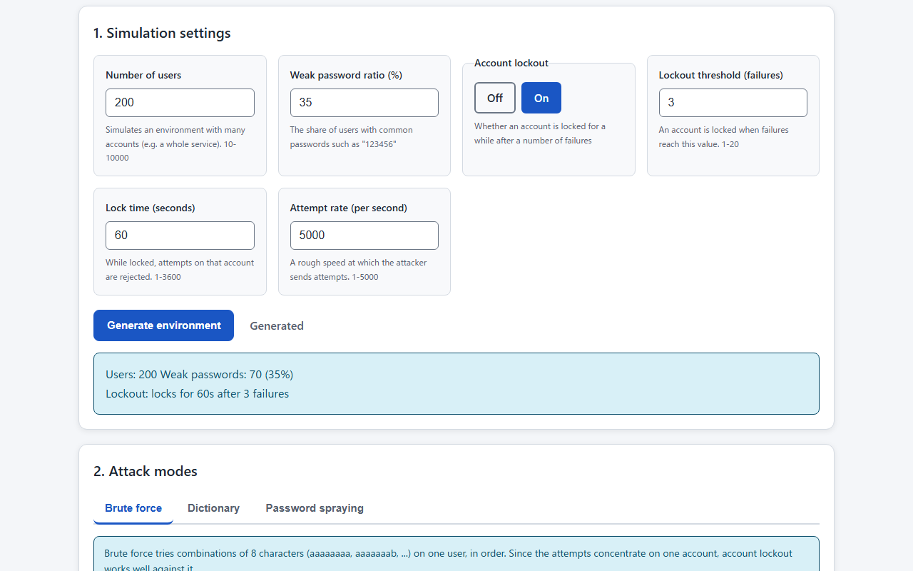
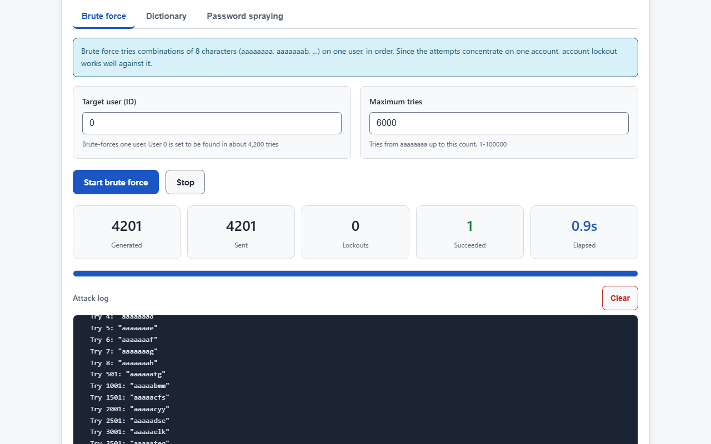
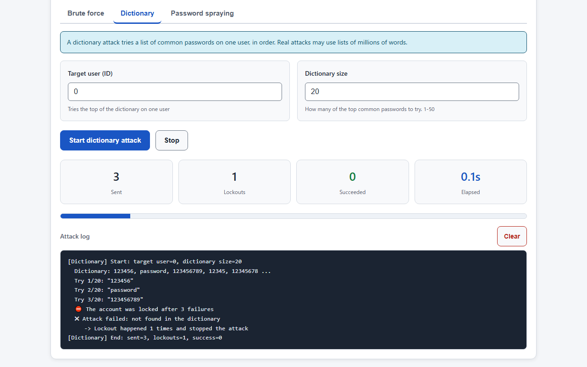
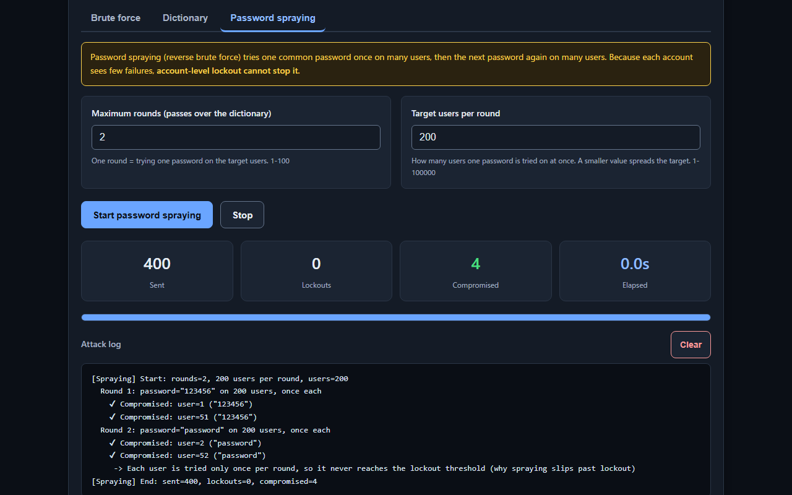
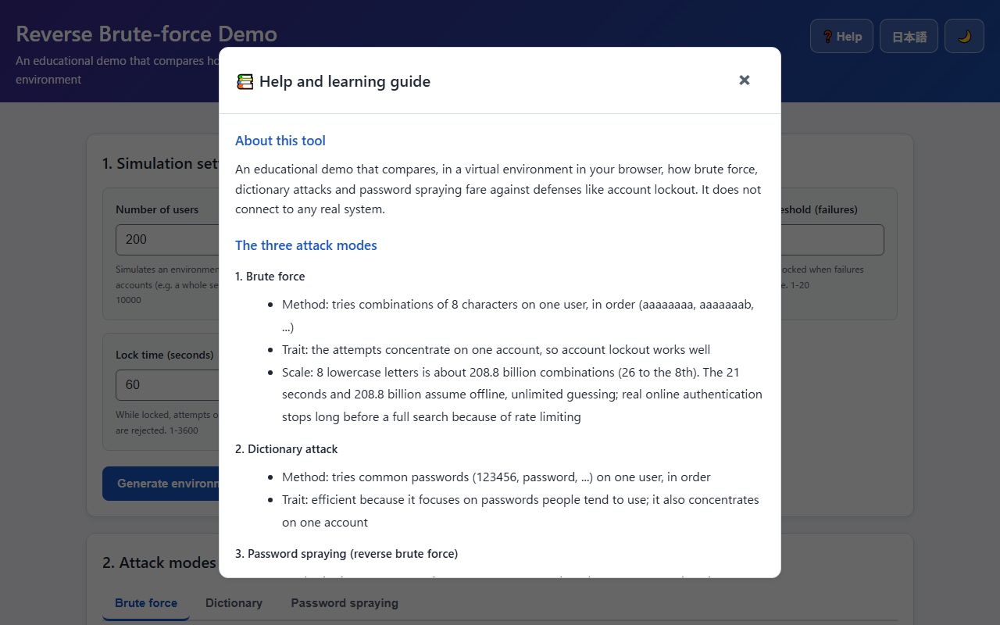

English · [日本語](README.md)

# Reverse Brute-force Demo - Password Spraying Attack Visualization Tool


[](https://ipusiron.github.io/reverse-bruteforce-demo/)

**Day060 - 100 Security Tools with Generative AI**

Reverse Brute-force Demo is an educational demo that compares, in one virtual environment, how brute force, dictionary attacks and password spraying (reverse brute force) fare against defenses like account lockout.

Everything is computed in your browser and runs against a group of virtual users. It does not connect to any real system and does not send what you enter anywhere.

---

## 🌐 Demo

👉 **[https://ipusiron.github.io/reverse-bruteforce-demo/](https://ipusiron.github.io/reverse-bruteforce-demo/)**

You can try it directly in your browser.

---

## 📸 Screenshots

>
>
>*Set the number of users, the weak-password ratio and lockout, then generate the virtual environment*

>
>
>*With lockout off, brute-forcing one user succeeds in about 4,200 tries*

>
>
>*With lockout on, a dictionary attack that concentrates on one user stops at the failure threshold*

>
>
>*Password spraying keeps each account's failures low, so it compromises users even with lockout on (dark mode)*

>
>
>*The help summarizes the three methods, the difference from a similar attack, and the key defenses*

---

## ✨ Features

### Virtual environment settings

- Set the number of users (10-10000), the weak-password ratio (%) and the attempt rate (per second), then generate the environment
- Toggle account lockout on or off and set its threshold (failures) and time (seconds)
- Show the number of users, the number of weak passwords and the lockout settings of the generated environment

### Three attack modes

- Brute force: tries combinations of 8 characters on one user, in order. It concentrates on one account
- Dictionary attack: tries a list of common passwords on one user, in order
- Password spraying (reverse brute force): tries one password once on many users, then the next password again on many users
- Each mode shows KPIs (sent, lockouts, success or compromise, elapsed time), an attack log and a progress bar

### Whole page

- Japanese and English (also `?lang=ja` and `?lang=en`)
- Light and dark mode (follows the OS setting at first)
- A help modal that summarizes the three methods, the difference from a similar attack, and the key defenses

---

## 📖 How to use

1. Open the [demo page](https://ipusiron.github.io/reverse-bruteforce-demo/).
2. Set the number of users, the weak-password ratio and lockout, then press "Generate environment".
3. Pick an attack mode in the tabs and start it. Read the result in the KPIs and the log.
4. Toggle lockout on and off and compare how the same attack fares.
5. See that lockout works against brute force and dictionary attacks but not against spraying.

---

## 🔐 The three attacks and how defenses fare

The three methods split by whether they concentrate on one user or spread across many. This splits how account-level lockout fares.

| Method | How it tries | How lockout fares |
|---|---|---|
| Brute force | Combinations of characters on one user, in order | Works well (one user's failures reach the threshold quickly) |
| Dictionary attack | Common passwords on one user, in order | Works well (same) |
| Password spraying | One password on many users, once each | Weak (each user sees few failures) |

In password spraying, one round (one password) tries each user only once. If the number of rounds is below the threshold, no account reaches the lockout threshold, and it slips past lockout. That is why, even with lockout on in this tool, spraying still compromises users with weak passwords.

MITRE ATT&CK calls this method "password spraying" (T1110.003). It tries a few common passwords on many accounts, slowly and spread out. "Reverse brute force" means almost the same thing. It is a different attack from **credential stuffing** (T1110.004), which reuses leaked "username and password pairs".

The scale of brute force is about 208.8 billion combinations for 8 lowercase letters (26 to the 8th). This tool's "success in about 21 seconds" assumes offline, unlimited guessing; real online authentication stops long before a full search because of rate limiting.

---

## 🛡 Key defenses

The lesson of this tool is that account-level lockout alone cannot stop password spraying. Think of defenses in layers.

- Multi-factor authentication (MFA, especially phishing-resistant): the most effective measure; it stops a compromise even when the password is guessed
- Rate limiting and throttling: limit not only per account but also per IP, subnet and globally
- Blocklist of leaked and common passwords: NIST SP 800-63B (Rev.4) does not require composition rules (complexity) or periodic changes, and asks you to reject leaked or common passwords
- Cross-account correlation: watch for the same password being tried on many accounts

---

## 🎯 Use cases

### Ways of using this tool in particular

- Reading the threshold as a sensitivity knob (statistics and detection-design classes): enable lockout, set the threshold to 5, and run a brute-force attack on one account; it locks after 5 failures and nothing falls (0 compromised). Disable lockout and it falls on the 4,200th try (1 compromised). This threshold is the sensitivity, how many failures count as abnormal; lowering it stops an attack sooner, but a legitimate user who mistypes trips it at the same count. You can check with numbers the same trade-off as the sensitivity of a spam filter or a fraud detector
- Seeing the gap in a control measured on one axis (defense-in-depth classes): spray one password to all 50 users once each, working down the dictionary. Even with lockout enabled, 5 accounts fall, and these are the people who used the 5 most common passwords (the same count as the threshold). With it disabled, 19 fall. Per-account lockout cuts the damage from 19 to 5 but cannot reach 0. Just as per-IP rate limiting is slipped past by a botnet, a control counted on a single axis leaves a gap, which shows why detection on another axis (source, password, velocity) is needed
- Seeing how the share of weak passwords sets the breach size (risk management and user education): disable lockout and let the spray over all users run to the end, and everyone using a dictionary password falls. With a weak share of 20, 40 and 60%, 9, 19 and 29 of the 50 users fall respectively (people with a strong password not in the dictionary survive, and one has a separate brute-force password). You can vary the population and confirm that the breach size grows roughly in proportion to the share of people reusing common passwords

### Learning and teaching

- In a security class or training, the teacher toggles lockout on and off in the same environment and shows how the three methods fare. Learners can follow "why spraying slips past lockout" in the KPIs and the log
- Someone learning authentication design changes the rounds and the threshold and sees for themselves that "spraying does not lock when the rounds are below the threshold"
- Someone learning password policy changes the weak-password ratio and sees how the number of compromised users changes for dictionary attacks and spraying

### At work

- An authentication designer uses it to show a team or a manager that account-level lockout alone is not enough, and the need for layered defenses (MFA, multi-axis rate limiting, blocklists, correlation)
- In internal awareness, show how common passwords (123456, password, ...) fall instantly to a dictionary attack or spraying, and convey the value of blocking leaked and common passwords
- In incident response or detection-rule design, see the shape of spraying, where one password is tried on many accounts, in the form of a log

### Daily life and research

- Use it as a reason to check whether your own or your family's passwords are on a list of common passwords (this tool does not connect to any real account)
- Follow the references in the help from the standards (NIST SP 800-63B) and the attack taxonomy (MITRE ATT&CK) to the primary sources

The author intends this for understanding attacks and learning defense, and does not encourage unauthorized access to real systems.

---

## 🔬 Technical notes

### Files

- `js/rbf-core.js`: the computation (no DOM). Generating the virtual environment (seeded randomness), the login check (lockout), and the plans for the three methods (brute force, dictionary, reverse brute force)
- `js/app.js`: the page (settings, tabs, running attacks and the log, the help modal)
- `js/messages.js`: Japanese and English text and how the help is built
- `js/i18n.js`, `js/theme.js` and `js/theme-init.js`: language and theme switching

### Virtual environment

- Users are split into weak and strong passwords. Weak user 0 gets a password findable by brute force (8 characters); weak users from 1 get the top of the dictionary in order; the rest get strong passwords not in the dictionary
- The login check, when lockout is on, locks an account for a while after the threshold of failures. While locked, attempts on that account are not sent
- Strong passwords come from seeded randomness, so the same settings reproduce the same environment. `Math.random` is not used

### Sharding in reverse brute force

Making the target users per round smaller reduces how many users one password is tried on at once, and spreads the target across rounds. For example, with 200 users and 3 rounds, 200 target users send 600 attempts and 20 target users send 60. This represents spreading the attack over time to avoid detection.

### Dictionary source

The 50 common passwords in the dictionary are taken from the top of rockyou and the NCSC "Top 100,000 passwords" bundled in SecLists (danielmiessler, MIT license). The order differs by source and year.

---

## 🔒 Security

- The CSP is set in a meta element and limited to `default-src 'self'` and friends (`script-src 'self'`, `style-src 'self'`, `connect-src 'none'` and so on). There are no inline scripts, style attributes or event handlers
- No external scripts (CDN) are loaded. The page does not communicate with anything (`connect-src 'none'`, no fetch). What you enter never leaves the browser and is not saved (only the language and theme choices are saved)
- The page writes with `textContent` and does not use `innerHTML`
- `<meta name="referrer" content="no-referrer">`, and external links use `rel="noopener noreferrer"`
- GitHub Pages cannot set custom response headers. frame-ancestors does not work in a meta CSP, so embedding in other sites cannot be prevented

---

## ⚠️ Notes and limitations

- This tool is an educational simulation that runs entirely in your browser. Unauthorized access to real systems is illegal
- The attacks are simulated against a group of virtual users; no real authentication happens. The attempt rate and the elapsed time are a rough representation of the work
- The "about 21 seconds" and about 208.8 billion combinations for brute force assume offline, unlimited guessing. Real online attacks stop because of rate limiting
- The dictionary is the 50 widely known top passwords, far smaller than the lists of millions used in real attacks

---

## 🧪 Tests

```bash
npm test
```

- Runs with `node --test` on Node.js 22 or later. There are no dependencies
- GitHub Actions runs the tests on every push and pull request
- The tests check the computation (the virtual environment, the login check, the three plans, sharding), the HTML (CSP, the ARIA of the tabs and the modal, input sizes), the text (Japanese/English keys, writing rules, agreement with the primary sources), the colors (contrast) and the formatting

---

## 🔗 References

- NIST SP 800-63B, Digital Identity Guidelines, Authentication and Authenticator Management [https://pages.nist.gov/800-63-4/sp800-63b.html](https://pages.nist.gov/800-63-4/sp800-63b.html)
- MITRE ATT&CK, T1110 Brute Force (T1110.003 Password Spraying, T1110.004 Credential Stuffing) [https://attack.mitre.org/techniques/T1110/](https://attack.mitre.org/techniques/T1110/)
- OWASP, Credential Stuffing [https://owasp.org/www-community/attacks/Credential_stuffing](https://owasp.org/www-community/attacks/Credential_stuffing)
- OWASP Web Security Testing Guide, Testing for Weak Lock Out Mechanism
- SecLists (danielmiessler), common password lists (rockyou, NCSC Top 100,000) [https://github.com/danielmiessler/SecLists](https://github.com/danielmiessler/SecLists)
- W3C, ARIA Authoring Practices Guide, Tabs Pattern / Dialog (Modal) Pattern [https://www.w3.org/WAI/ARIA/apg/patterns/](https://www.w3.org/WAI/ARIA/apg/patterns/)

---

## 📁 Directory structure

```text
reverse-bruteforce-demo/
├── .github/                   # GitHub settings
│   └── workflows/             # GitHub Actions workflows
│       └── test.yml           # Runs npm test on push and pull request
├── assets/                    # README screenshots
│   ├── en/                    # Screenshots of the English page
│   │   ├── screenshot.png     # Settings and environment stats
│   │   ├── screenshot2.png    # Brute force succeeds
│   │   ├── screenshot3.png    # Dictionary stopped by lockout
│   │   ├── screenshot4.png    # Spraying slips past lockout
│   │   └── screenshot5.png    # Help
│   ├── screenshot.png         # Settings and environment stats (Japanese page)
│   ├── screenshot2.png        # Brute force succeeds (Japanese page)
│   ├── screenshot3.png        # Dictionary stopped by lockout (Japanese page)
│   ├── screenshot4.png        # Spraying slips past lockout (Japanese page)
│   └── screenshot5.png        # Help (Japanese page)
├── js/                        # Page and computation scripts
│   ├── app.js                 # The page (settings, tabs, attacks, help)
│   ├── i18n.js                # Language choice and static text
│   ├── messages.js            # Japanese and English text, help building
│   ├── rbf-core.js            # Computation (environment, login check, plans)
│   ├── theme-init.js          # Applies the saved theme before drawing
│   └── theme.js               # Light/dark toggle
├── test/                      # node --test tests
│   ├── contrast.test.js       # Color contrast
│   ├── core.test.js           # Computation
│   ├── format.test.js         # Line length, line endings, control characters
│   ├── html.test.js           # index.html (CSP, ARIA, inputs)
│   ├── i18n.test.js           # Language detection
│   ├── load.js                # Loads the page scripts into the tests
│   ├── messages.test.js       # Text (keys, writing rules, primary sources)
│   └── readme.test.js         # README tables, examples and structure
├── .gitignore                 # Files Git does not track
├── .nojekyll                  # No Jekyll on GitHub Pages
├── CLAUDE.md                  # Project notes for Claude Code
├── LICENSE                    # MIT license
├── README.en.md               # English README (this file)
├── README.md                  # Japanese README
├── index.html                 # The page
├── package.json               # npm test settings (no dependencies)
└── style.css                  # Colors (light/dark) and layout
```

---

## 💻 Requirements

- A recent Chrome, Edge, Firefox or Safari (desktop and phones)
- Opening `index.html` directly in the browser (`file://`) works. To use a local server, run `python -m http.server 8000` and open `http://localhost:8000/`
- Tests need Node.js 22 or later

---

## 📄 License

MIT License - see [LICENSE](LICENSE) for details.

---

## 🛠 About this tool

This tool was developed as part of the "100 Security Tools with Generative AI" project.
The project builds and publishes a wide range of security-related tools over 100 days with the help of AI.

For details of the project and the other tools, see the following page.

🔗 [https://akademeia.info/?page_id=42163](https://akademeia.info/?page_id=42163)
