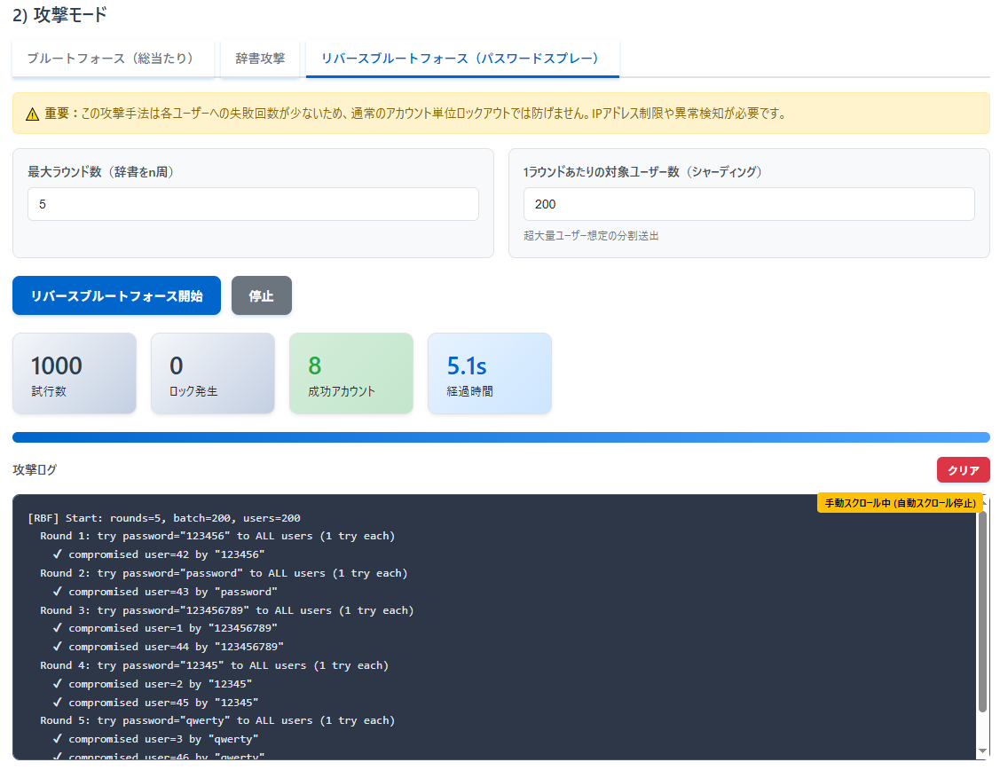

<!--
---
id: day060
slug: reverse-bruteforce-demo

title: "Reverse Brute-force Demo"

subtitle_ja: "リバースブルートフォース攻撃デモツール"
subtitle_en: "Password Spraying Attack Visualization Tool"

description_ja: "アカウント単位ロックアウトを導入している環境で、従来のブルートフォース攻撃とリバースブルートフォース攻撃（パスワードスプレー）の違いを直感的に理解できる教育用デモツール"
description_en: "Educational demo tool to visualize how reverse brute-force (password spraying) can bypass account lockout policies compared to traditional brute-force attacks"

category_ja:
  - パスワード解析
  - 認証
category_en:
  - Password Cracking
  - Authentication

difficulty: 2

tags:
  - bruteforce
  - reverse-bruteforce
  - password-spray
  - lockout
  - authentication
  - visualization
  - education

repo_url: "https://github.com/ipusiron/reverse-bruteforce-demo"
demo_url: "https://ipusiron.github.io/reverse-bruteforce-demo/"

hub: true
---
-->


[](https://ipusiron.github.io/reverse-bruteforce-demo/)

**Day060 - 生成AIで作るセキュリティツール100**

# Reverse Brute-force Demo - リバースブルートフォース攻撃デモツール

アカウント単位ロックアウトを導入している環境で、**従来のブルートフォース攻撃**と  
**リバースブルートフォース攻撃（パスワードスプレー）**の違いを直感的に理解できる教育用デモツールです。  

本ツールはあくまで「攻撃ぽさを演出」するデモであり、実際の総当たりを行うものではありません。  
攻撃手法の理解と、防御策の学習を目的としています。

---

## 🌐 デモページ

👉 **[https://ipusiron.github.io/reverse-bruteforce-demo/](https://ipusiron.github.io/reverse-bruteforce-demo/)**

ブラウザーで直接お試しいただけます。

---

## 📸 スクリーンショット

>  
>*リバースブルートフォース攻撃のデモ*

---

## 🎯 背景と目的

- **ブルートフォース**  
  IDを固定 ⇒ パスワードを総当たり ⇒ ターゲットは**特定のユーザー**。  
- **リバースブルートフォース**  
  パスワード（ヒットしやすいもの）を固定 ⇒ IDを総当たり ⇒ ターゲットは**誰でもよい（絨毯爆撃）**。  

この違いにより、従来のアカウント単位ロックアウトが効かないシナリオが生まれる。  
本ツールはその挙動をシンプルに可視化し、セキュリティ対策の必要性を理解させる。

---

## ✨ 主な機能

- **3つの攻撃モード**を実装：ブルートフォース（総当たり）・辞書攻撃・リバースブルートフォース（パスワードスプレー）
- **柔軟な環境設定**：ユーザー数、弱パスワード比率、ロックアウト有無・閾値などを設定可能
- **リアルタイム可視化**：生成パスワード数・送信数・ロック発生数・成功数・経過時間をリアルタイム表示
- **スマート自動スクロール**：ユーザーが過去ログ確認中は自動スクロールを停止
- **教育的ヒント機能**：各攻撃モードに初学者向けの解説とヒントを表示
- **包括的ヘルプ**：攻撃手法の理論・防御策・使い方をモーダルで確認可能  

---

## 🔐 座学：ブルートフォースとリバースブルートフォース

### 歴史と事例

- 1970年代のUNIXシステムではパスワードハッシュが簡易で、**ブルートフォース攻撃**による総当たりが現実的だった。  
- 1980年代には「辞書攻撃」が登場し、人間がよく使う単語に絞ることで効率化。  
- 2000年代後半以降、組織に多数のアカウントが存在する環境で「**パスワードスプレー**（リバースブルートフォース）」が注目された。  
  - 例: OWA (Outlook Web Access) やVPNログインに対し「Spring2020!」のような流行パスワードを一斉試行。  
- 近年のMicrosoft 365やクラウドサービスへの攻撃でも頻繁に観測され、主要な侵入経路の1つとなっている。  

### 攻撃シナリオ例

- **ブルートフォース攻撃**  
  - 攻撃者が特定ユーザー（例:"admin"）のパスワードを辞書から順番に試す。  
  - ロックアウトに阻まれやすい。  

- **リバースブルートフォース攻撃**  
  - 攻撃者が特定パスワード（例："123456"）を全ユーザーに1回ずつ試す。  
  - 各アカウントの失敗回数が閾値を超えにくく、侵害に成功しやすい。  

### それぞれの比較

| 項目 | ブルートフォース | リバースブルートフォース |
|------|------------------|--------------------------|
| 固定するもの | **ID** | **パスワード** |
| 総当たり対象 | パスワード | ID（アカウント） |
| ターゲット | 固定（特定の1人） | 誰でもよい（絨毯爆撃） |
| ロックアウト | されやすい | されにくい |
| 成功条件 | 特定ユーザーの正解PWを見つける | 弱PWユーザーが存在する |
| 防御策 | アカウント単位ロックアウト | グローバルレート制限、共通PW拒否、相関検知 |

---

## 🔄 パスワードスプレーとリバースブルートフォース

両者は **実質的に同一の攻撃手法** を指します。  
いずれも「**1つのパスワードを多数のアカウントに試す**」点が共通で、弱パスワード利用者がいれば突破可能です。

- **Reverse Brute-force Attack**  
  - 通常のブルートフォース（ID固定・PW総当たり）の「逆」を意味する学術的な表現。  
  - パスワードを固定し、IDを総当たりすることに着目。  

- **Password Spraying Attack**  
  - 「同じパスワードを広くスプレー（吹き付ける）」イメージから名付けられた現場寄りの用語。  
  - Microsoftやクラウドベンダーのドキュメントではこちらが主流。  

一部では以下のようなニュアンスで使い分けられます。  

| 用語 | 主な文脈 | ニュアンス |
|------|----------|------------|
| リバースブルートフォース | 学術・研究的表現 | 「ブルートフォースの逆」という概念を強調 |
| パスワードスプレー | 実務・運用的表現 | 「複数のよくあるパスワードを順にスプレー」する実践的攻撃 |

👉 結論：本ツールでは **「リバースブルートフォース」＝「パスワードスプレー」** として扱います。

---

## 🛡 セキュリティ対策

- **多軸レート制限**: アカウント、IP、デバイス、ASN/サブネット単位で制御  
- **共通・漏えいパスワード拒否**: 「123456」などは登録不可にする  
- **MFAの導入**: 特にリスク検知時に多要素認証を強制  
- **相関検知**: 短時間で同一PWが多アカウントに失敗していないかを監視  

---

## ⚔️ 攻撃者の発展手法

- **Password Spraying**: リバースブルートフォースと同義  
- **Credential Stuffing**: 流出リストのID/パスワード組を横展開  
- **スマートブルートフォース**: 季節や人名などを混ぜた辞書で効率化  
- **分散攻撃**: ボットネットを使いIP制限を回避  

---

## 💻 攻撃コマンド例（教育目的）

### ブルートフォース（ID固定）

```bash
# Hydraを使い、adminアカウントに辞書を総当たり
$ hydra -l admin -P rockyou.txt target.com http-post-form "/login:user=^USER^&pass=^PASS^:F=incorrect"
```

### リバースブルートフォース（PW固定）

```bash
# Hydraを使い、全ユーザーリストに対して同一パスワードを試す
$ hydra -L users.txt -p "Spring2024!" target.com http-post-form "/login:user=^USER^&pass=^PASS^:F=incorrect"
```

## 🔓 オフライン攻撃　＜John the Ripper＞

### ブルートフォース（ID固定・PW総当たり）

特定ユーザーのハッシュに対して、すべての文字組み合わせを総当たりする。

```bash
# DES/MD5 など古典的ハッシュを想定した総当たり
$ john --incremental hash.txt

# モードを指定して文字種や長さを調整することも可能
$ john --incremental=All --min-length=1 --max-length=6 hash.txt
```

👉 この場合、ID（ユーザー）は固定で、パスワードを総当たりする。

### リバースブルートフォース（PW固定・ID総当たり）

同じパスワード候補を複数ユーザーのハッシュに一斉に試す。

```bash
# 「Password123」という候補を全ユーザーに試す
$ echo "Password123" > singlepw.txt
$ john --wordlist=singlepw.txt hash.txt

# 複数の「ありがちパスワード」を試す（パスワードスプレー相当）
$ echo -e "Password123\nSpring2024!\n123456" > spray.txt
$ john --wordlist=spray.txt hash.txt
```

※ 本ツールはこれらを模倣した教育用デモであり、実際の攻撃は行いません。

## 📐 本ツールの詳細仕様

### 🎯 攻撃モード

1. **ブルートフォース（総当たり攻撃）**
   - 8文字の全組み合わせを順次試行（aaaaaaaa, aaaaaaab, ...）
   - 単一ユーザー集中攻撃でロックアウト効果を実感
   - ロックアウト無効時は約21秒で成功するよう調整済み

2. **辞書攻撃**
   - 実際のよくあるパスワードリスト（最大50種類）から選択して試行
   - 辞書サイズを1-50で可変設定
   - デフォルト20件で3回目の試行で成功

3. **リバースブルートフォース（パスワードスプレー）**
   - 共通パスワードを全ユーザーに1回ずつラウンド実行
   - アカウント単位ロックアウトを回避する攻撃手法
   - 各ユーザーの失敗回数を分散させて突破

### ⚙️ 環境設定

- **ユーザー数**：10～10,000ユーザーの仮想環境
- **弱パスワード比率**：0～100%で調整可能
- **ロックアウト制御**：有効/無効の切り替え + 閾値・時間設定
- **試行レート**：1～5,000 req/secで攻撃速度を調整

### 📊 可視化機能

- **2段階KPI表示**：
  - ブルートフォース：生成パスワード数 + 実際の送信数を分離表示
  - その他攻撃：試行数の統一表示
- **リアルタイムログ**：攻撃進行状況をコンソール風に表示
- **スマートスクロール**：手動スクロール中は自動スクロール停止
- **プログレスバー**：攻撃進捗の視覚的表示

## 🔰 初学者向け：効果的な段階的使用方法

セキュリティを学び始める方に向けた、このツールの効果的な使用手順をご紹介します。

### 📋 推奨学習ステップ

#### ステップ1：基本概念の理解（5分）
1. **ヘルプボタン**をクリックして基本概念を確認
2. 3つの攻撃手法の違いを理解
   - ブルートフォース：1人に集中攻撃
   - 辞書攻撃：よくあるパスワードを試行
   - リバースブルートフォース：多数に分散攻撃

#### ステップ2：ロックアウト効果の体験（10分）
1. **環境設定**：デフォルト設定のまま（ユーザー200人、弱PW比率35%）
2. **ロックアウト有効**に設定（閾値3回、時間60秒）
3. **環境を生成**をクリック
4. **ブルートフォース攻撃**を実行
   - → ロックアウトが発生し、攻撃が阻止される様子を観察
5. **辞書攻撃**を実行（ユーザーID 1、辞書サイズ20）
   - → 3回目でロックアウトが発生する様子を確認

#### ステップ3：ロックアウト無効の危険性（10分）
1. **ロックアウトを無効**に変更
2. **環境を生成**（設定変更後は再生成が必要）
3. **ブルートフォース攻撃**を再実行
   - → 約21秒で成功する様子を観察
   - → 生成パスワード数と送信数の違いに注目
4. **辞書攻撃**を再実行
   - → 3回目で即座に成功することを確認

#### ステップ4：リバースブルートフォースの脅威（15分）
1. **ロックアウト有効**に戻す
2. **環境を生成**
3. **リバースブルートフォース攻撃**を実行
   - ラウンド数：5回
   - 対象ユーザー数：200人
4. **観察ポイント**：
   - ロックアウトがほとんど発生しない
   - 複数のアカウントが侵害される
   - アカウント単位制限の限界を実感

#### ステップ5：パラメーター実験（15分）
以下のパラメーターを変更して効果を比較：

**実験A：弱パスワード比率の影響**
- 比率を10%、50%、80%で変更
- リバースブルートフォースの成功率の変化を観察

**実験B：ロックアウト閾値の調整**
- 閾値を1回、5回、10回で変更
- ブルートフォース攻撃への影響を確認

**実験C：辞書サイズの効果**
- 辞書攻撃で5件、20件、50件を試行
- 成功までの試行回数の変化を記録

### 💡 学習効果を高めるコツ

1. **ログを注意深く読む**
   - 各攻撃でどのような挙動になるかを確認
   - 手動スクロールで過去の状況も振り返る

2. **KPI数値の比較**
   - 各攻撃手法での「試行数」「ロック発生数」「成功数」を記録
   - Excel等でグラフ化すると理解が深まる

3. **実際のシナリオで考える**
   - 「自分の会社で同じ攻撃を受けたらどうなるか？」
   - 「どのような対策がもっとも効果的か？」

4. **段階的な理解**
   - いきなりすべてを理解しようとせず、1つずつ確実に
   - 疑問点はヘルプモーダルで再確認

### 🎯 学習目標チェックリスト

各ステップ完了時に以下を確認：

- [ ] 3つの攻撃手法の違いを説明できる
- [ ] ロックアウトの効果と限界を理解している
- [ ] リバースブルートフォースの危険性を実感している
- [ ] パラメーター変更による影響を予測できる
- [ ] 実務での防御策を複数思いつく

## 🎓 活用シナリオ例

### シナリオ1：企業セキュリティ研修での活用

**対象**：企業の従業員（IT部門・一般職問わず）  
**目的**：パスワード攻撃の実態理解と強固なパスワードポリシーの必要性を体感

**研修の流れ：**
1. **導入（5分）**：一般的なパスワード攻撃の概要説明
2. **デモンストレーション（15分）**：
   - ロックアウト無効で辞書攻撃を実行 → 弱いパスワードの危険性を実感
   - ロックアウト有効でブルートフォース攻撃 → 防御機能の効果を確認
   - リバースブルートフォース攻撃 → アカウント単位制限の限界を理解
3. **ディスカッション（10分）**：
   - 「自社で同様の攻撃を受けたらどうなるか？」
   - 「現在のパスワードポリシーで十分か？」
4. **アクションプラン（10分）**：MFA導入、パスワードポリシー見直し等の検討

**期待効果**：従業員のパスワードセキュリティ意識向上、セキュリティ対策の必要性理解

### シナリオ2：サイバーセキュリティ教育での活用

**対象**：大学・専門学校のサイバーセキュリティ関連コース受講生  
**目的**：攻撃手法の技術的理解と防御策の設計能力向上

**授業での活用：**
1. **理論学習**：ヘルプモーダルで攻撃手法の歴史・仕組みを学習
2. **実習課題**：
   - **課題A**：「ロックアウト設定を変えて攻撃成功率の変化を観察・レポート作成」
   - **課題B**：「弱いパスワード比率と攻撃成功の関係性を定量分析」
   - **課題C**：「企業環境を想定した最適なセキュリティ設定を提案」
3. **応用演習**：
   - グループディスカッション：「多層防御としてのセキュリティ対策設計」
   - プレゼンテーション：「実際のセキュリティ事例との比較分析」

**学習目標達成**：
- 攻撃者視点でのセキュリティ脆弱性理解
- 定量的データに基づいた防御策評価能力
- 実務で応用可能なセキュリティ設計思考

## 📁 ディレクトリー構成

```text
reverse-bruteforce-demo/
├── index.html
├── style.css
├── script.js
├── assets/
│   └── screenshot.png
└── README.md
```

## 📄 ライセンス

MIT License – 詳細は [LICENSE](LICENSE) を参照してください。

---

## 🛠 このツールについて

本ツールは、「生成AIで作るセキュリティツール100」プロジェクトの一環として開発されました。 
このプロジェクトでは、AIの支援を活用しながら、セキュリティに関連するさまざまなツールを100日間にわたり制作・公開していく取り組みを行っています。

プロジェクトの詳細や他のツールについては、以下のページをご覧ください。  

🔗 [https://akademeia.info/?page_id=42163](https://akademeia.info/?page_id=42163)
