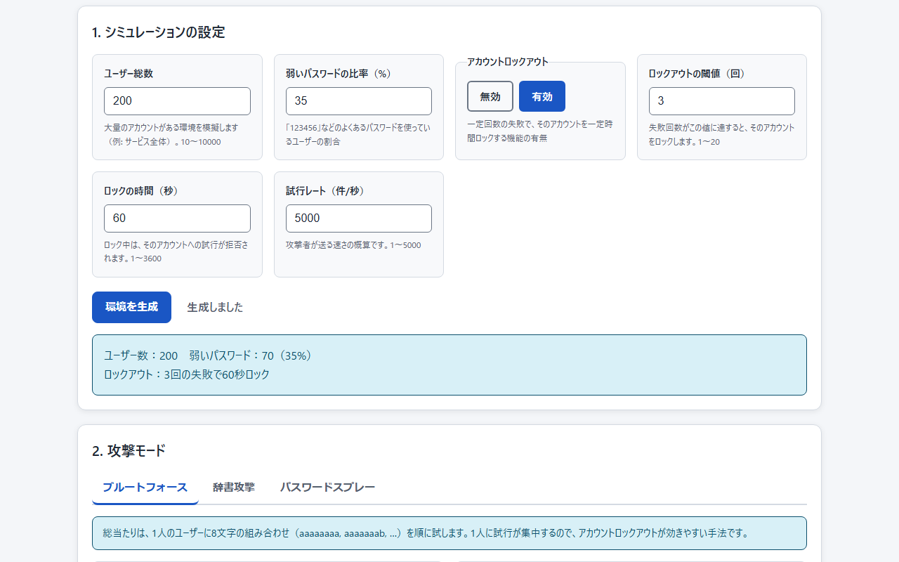
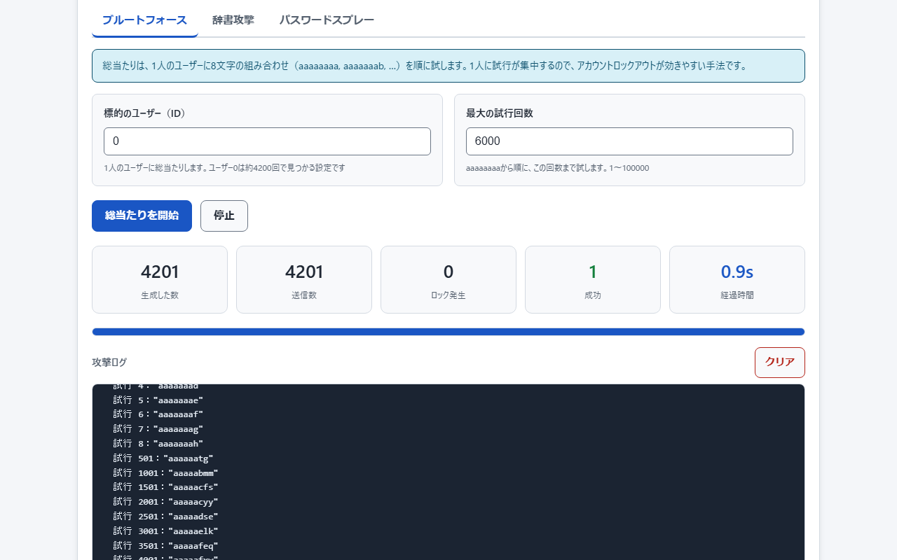
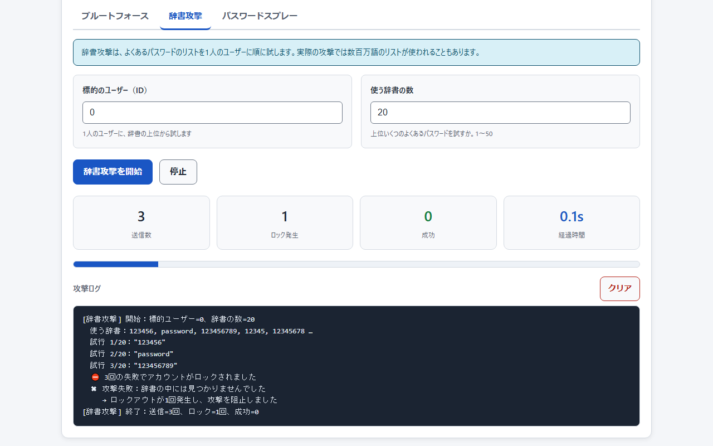
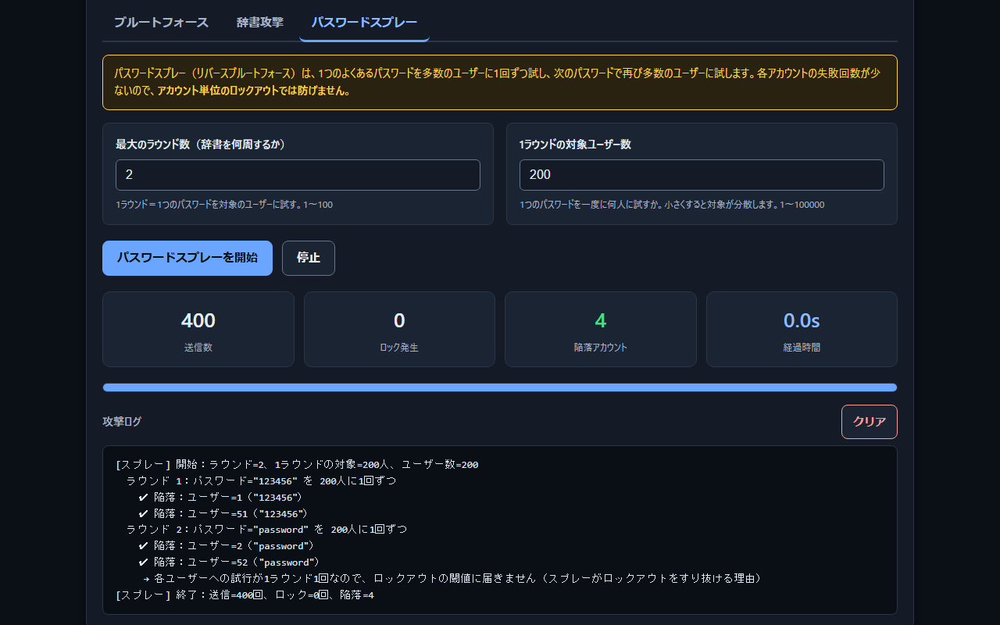
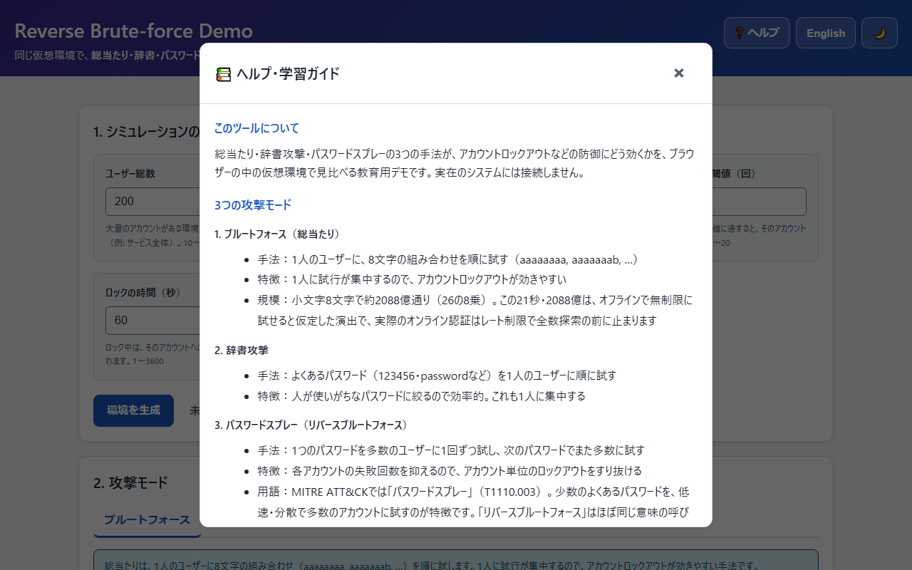

<!--
---
id: day060
slug: reverse-bruteforce-demo

title: "Reverse Brute-force Demo"

subtitle_ja: "リバースブルートフォース攻撃デモツール"
subtitle_en: "Password Spraying Attack Visualization Tool"

description_ja: "アカウント単位ロックアウトを導入している環境で、従来のブルートフォース攻撃とリバースブルートフォース攻撃（パスワードスプレー）の違いを直感的に理解できる教育用デモツール"
description_en: "Educational demo tool to visualize how reverse brute-force (password spraying) can bypass account lockout policies compared to traditional brute-force attacks"

category_ja:
  - パスワード解析
  - 認証
category_en:
  - Password Cracking
  - Authentication

difficulty: 2

tags:
  - bruteforce
  - reverse-bruteforce
  - password-spray
  - lockout
  - authentication
  - visualization
  - education

repo_url: "https://github.com/ipusiron/reverse-bruteforce-demo"
demo_url: "https://ipusiron.github.io/reverse-bruteforce-demo/"

hub: true
---
-->

[English](README.en.md) · 日本語

# Reverse Brute-force Demo - リバースブルートフォース攻撃デモツール


[](https://ipusiron.github.io/reverse-bruteforce-demo/)

**Day060 - 生成AIで作るセキュリティツール100**

Reverse Brute-force Demoは、ブルートフォース・辞書攻撃・パスワードスプレー（リバースブルートフォース）の3つの手法が、アカウントロックアウトなどの防御にどう効くかを、同じ仮想環境で見比べる教育用デモです。

すべての計算はブラウザーの中だけで行い、仮想のユーザー群に対して動きます。実在のシステムには接続せず、入力した値を外へ送りません。

---

## 🌐 デモページ

👉 **[https://ipusiron.github.io/reverse-bruteforce-demo/](https://ipusiron.github.io/reverse-bruteforce-demo/)**

ブラウザーで直接お試しいただけます。

---

## 📸 スクリーンショット

>
>
>*ユーザー数・弱いパスワードの比率・ロックアウトを設定して、仮想環境を生成する*

>
>
>*ロックアウトが無効だと、1人のユーザーへの総当たりは約4200回で成功する*

>
>
>*ロックアウトが有効だと、1人に集中する辞書攻撃は閾値の失敗で止まる*

>
>
>*パスワードスプレーは各アカウントの失敗が少ないので、ロックアウトが有効でも陥落させる（ダークモード）*

>
>
>*ヘルプに、3手法の違い・似た攻撃との違い・防御の要点をまとめている*

---

## ✨ 機能

### 仮想環境の設定

- ユーザー総数（10〜10000）、弱いパスワードの比率（%）、試行レート（件/秒）を決めて環境を生成する
- アカウントロックアウトの有無・閾値（回）・時間（秒）を切り替える
- 生成した環境のユーザー数・弱いパスワードの数・ロックアウトの設定を表示する

### 3つの攻撃モード

- ブルートフォース：1人のユーザーに8文字の組み合わせを順に試す。1人に集中する
- 辞書攻撃：よくあるパスワードのリストを1人のユーザーに順に試す
- パスワードスプレー（リバースブルートフォース）：1つのパスワードを多数のユーザーに1回ずつ試し、次のパスワードで再び多数のユーザーに試す
- 各モードで、送信数・ロック発生・成功（陥落）・経過時間のKPIと、攻撃ログ、進捗バーを表示する

### 画面全体

- 日本語と英語の切り替え（`?lang=ja`・`?lang=en`でも指定できる）
- ライトモードとダークモード（最初はOSの設定に従う）
- ヘルプのモーダルに、3手法の違い・似た攻撃との違い・防御の要点をまとめている

---

## 📖 使い方

1. [デモページ](https://ipusiron.github.io/reverse-bruteforce-demo/)を開きます。
2. ユーザー数・弱いパスワードの比率・ロックアウトを設定し、「環境を生成」を押します。
3. タブで攻撃モードを選び、開始します。KPIとログで結果を見ます。
4. ロックアウトの有無を切り替えて、同じ攻撃の効き方の違いを比べます。
5. 総当たり・辞書ではロックアウトが効き、スプレーでは効きにくいことを確かめます。

---

## 🔐 3つの攻撃と、防御の効き方

3つの手法は、「1人に集中するか」「多数に広げるか」で分かれます。これが、アカウント単位のロックアウトの効き方を分けます。

| 手法 | 試し方 | ロックアウトの効き方 |
|---|---|---|
| ブルートフォース | 1人のユーザーに、文字の組み合わせを順に | 効きやすい（1人の失敗がすぐ閾値に達する） |
| 辞書攻撃 | 1人のユーザーに、よくあるパスワードを順に | 効きやすい（同上） |
| パスワードスプレー | 1つのパスワードを、多数のユーザーに1回ずつ | 効きにくい（各ユーザーの失敗が少ない） |

パスワードスプレーでは、1ラウンド（1つのパスワード）で各ユーザーに1回しか試しません。ラウンド数が閾値より少なければ、どのアカウントもロックアウトの閾値に届かず、ロックをすり抜けます。このツールでロックアウトを有効にしても、スプレーが弱いパスワードのユーザーを陥落させるのは、このためです。

MITRE ATT&CKでは、この手法を「パスワードスプレー」（T1110.003）と呼びます。少数のよくあるパスワードを、多数のアカウントに、低速・分散で試すのが特徴です。「リバースブルートフォース」はほぼ同じ意味の呼び方です。漏えいした「IDとパスワードの組」を使い回す**クレデンシャルスタッフィング**（T1110.004）とは別の攻撃です。

ブルートフォースの規模は、小文字8文字で約2088億通り（26の8乗）です。このツールの「約21秒で成功」は、オフラインで無制限に試せると仮定した演出で、実際のオンライン認証はレート制限で全数探索の前に止まります。

---

## 🛡 防御の要点

このツールの学びは、「アカウント単位のロックアウトだけでは、パスワードスプレーを防げない」ことです。防御は多層で考えます。

- 多要素認証（MFA。特にフィッシング耐性のあるもの）：パスワードが当たっても侵害を止められる、最も効果的な対策
- レート制限・スロットリング：アカウント単位だけでなく、IP・サブネット・全体の単位でも制限する
- 漏えい・頻出パスワードのブロックリスト：NIST SP 800-63B（Rev.4）は、構成規則（複雑性要求）や定期的な変更を求めず、漏えい済みや頻出のパスワードを拒否することを求めている
- 横断的な相関検知：同じパスワードが多数のアカウントに試される動きを監視する

---

## 🎯 ユースケース

### このツールならではの使い方

- しきい値を感度のつまみとして読む（統計・検知設計の授業）：ロックアウトを有効にして閾値を5にし、1人のアカウントにブルートフォースをかけると、5回失敗した時点でロックし、陥落は0になる。無効にすると4200回目で陥落1になる。この閾値は「何回の失敗で異常とみなすか」の感度で、下げるほど攻撃を早く止める一方、打ち間違えた正規の利用者も同じ回数でロックする。スパムフィルターや不正検知の感度と同じトレードオフを、数で確かめられる
- 1軸で測る対策の穴を見る（多層防御の授業）：1つのパスワードを50人全員に1回ずつ送るスプレーを、辞書の上から順に続ける。ロックアウトを有効にしても陥落は5人で、これは最もよくある5つ（＝閾値と同じ数）のパスワードを使っていた人である。無効だと陥落は19人になる。アカウント単位のロックアウトは被害を19人から5人へ減らすが、0にはできない。IP単位のレート制限がボットネットですり抜けられるのと同じで、1本の軸で数える対策には穴が残り、別の軸（送信元・パスワード・速度）の検知が要ることがわかる
- 弱いパスワードの比率が被害規模を決める（リスク管理・利用者教育）：ロックアウトを無効にして全員へのスプレーを最後まで続けると、辞書のパスワードを使う人はすべて陥落する。弱い比率を20・40・60%にすると、50人中の陥落はそれぞれ9・19・29人になる（辞書にない強いパスワードの人は残り、1人はブルートフォース用の別パスワード）。被害の規模が、よくあるパスワードを使い回す人の割合にほぼ比例して増えることを、母集団を変えて確かめられる

### 学ぶ・教える

- セキュリティの授業や研修で、先生が同じ環境でロックアウトを有効・無効に切り替え、3手法の効き方の違いを見せる。受講者は「なぜスプレーはロックアウトをすり抜けるのか」をKPIとログで追える
- 認証の設計を学ぶ人が、ラウンド数と閾値を動かして、「ラウンド数が閾値より少ないとロックしない」ことを自分で確かめる
- パスワードポリシーを学ぶ人が、弱いパスワードの比率を変えて、辞書やスプレーの陥落数がどう変わるかを見る

### 仕事に使う

- 認証の設計者が、「アカウント単位のロックアウトだけでは足りない」ことを、チームや上長に見せる材料にする。多層防御（MFA・多軸のレート制限・ブロックリスト・相関検知）の必要性を示す
- 社内の啓発で、よくあるパスワード（123456・passwordなど）が辞書やスプレーで一瞬で破られる様子を見せ、漏えい・頻出パスワードのブロックリストの意義を伝える
- インシデント対応や検知ルールの設計で、「同じパスワードが多数のアカウントに試される」スプレーの形を、ログの形で確かめる

### 暮らし・調べもの

- 自分や家族のパスワードが、よくあるパスワードのリストに入っていないかを確かめるきっかけにする（このツールは実在のアカウントには接続しません）
- 認証の規格（NIST SP 800-63B）や攻撃の分類（MITRE ATT&CK）を、ヘルプの参考から一次資料にたどって調べる

作者の意図は、攻撃の理解と防御の学習です。実在のシステムへの不正なアクセスは勧めません。

---

## 🔬 技術的な説明

### ファイルの役割

- `js/rbf-core.js`：計算部（DOMを使わない）。仮想環境の生成（種つき乱数）、ログインの判定（ロックアウト）、3手法のプラン（ブルートフォース・辞書・リバースブルートフォース）
- `js/app.js`：画面の処理（設定、タブ、攻撃の実行とログ、ヘルプのモーダル）
- `js/messages.js`：日本語と英語の文言、ヘルプの組み立て
- `js/i18n.js`・`js/theme.js`・`js/theme-init.js`：言語とテーマの切り替え

### 仮想環境

- ユーザーは「弱いパスワード」と「強いパスワード」に分かれます。弱いユーザーは、0番が総当たりで見つかる8文字、1番以降が辞書の上位から順に。残りは辞書に出てこない強いパスワードです
- ログインの判定は、ロックアウトが有効なとき、閾値の失敗でそのアカウントを一定時間ロックします。ロック中は、そのアカウントへの試行は送信されません
- 強いパスワードは種つきの乱数で作るので、同じ設定なら同じ環境を再現できます。`Math.random`は使いません

### リバースブルートフォースのシャーディング

1ラウンドの対象ユーザー数を小さくすると、1つのパスワードを一度に試す人数が減り、対象がラウンドごとに分散します。たとえば200人・3ラウンドで、対象を200人にすると送信は600回、20人にすると60回です。これは、検知を避けるために攻撃を時間的に分散させる動きを表します。

### 辞書の出典

辞書のよくあるパスワード50件は、SecLists（danielmiessler、MITライセンス）に同梱のrockyouと、NCSC「Top 100,000 passwords」の上位から選びました。順位は出典や年で異なります。

---

## 🔒 セキュリティ

- CSPはmeta要素で`default-src 'self'`系に限っています（`script-src 'self'`・`style-src 'self'`・`connect-src 'none'`など）。インラインのスクリプト・style属性・イベントハンドラーはありません
- 外部のスクリプト（CDN）を読みません。外と通信しません（`connect-src 'none'`、fetchを使わない）。入力した値はブラウザーの外へ出ず、保存もしません（保存するのは言語とテーマの選択だけ）
- 画面への書き込みは`textContent`で行い、`innerHTML`を使いません
- `<meta name="referrer" content="no-referrer">`、外部へのリンクは`rel="noopener noreferrer"`
- GitHub Pagesでは独自のレスポンスヘッダーを設定できません。meta要素のCSPではframe-ancestorsが効かないので、ほかのサイトへの埋め込みは防げません

---

## ⚠️ 注意と限界

- このツールはブラウザーの中だけで動く教育用のシミュレーションです。実在のシステムへの不正なアクセスは法律で禁じられています
- 攻撃は仮想のユーザー群に対する模擬で、実際の認証は行いません。試行レートや経過時間は、処理の目安を表す演出です
- ブルートフォースの「約21秒」や約2088億通りは、オフラインで無制限に試せると仮定した値です。現実のオンライン攻撃はレート制限で止まります
- 辞書は広く知られた上位50件で、実際の攻撃で使われる数百万語のリストとは規模が違います

---

## 🧪 テスト

```bash
npm test
```

- Node.js 22以上の`node --test`で動きます。依存パッケージはありません
- GitHub Actionsで、pushとpull requestのたびに自動で実行します
- 計算部（仮想環境・ログインの判定・3手法のプラン・シャーディング）、HTML（CSP・タブとモーダルのARIA・入力の大きさ）、文言（日英のキー・表記・一次資料との整合）、配色（コントラスト）、書式を検査します

---

## 🔗 参考文献

- NIST SP 800-63B, Digital Identity Guidelines, Authentication and Authenticator Management [https://pages.nist.gov/800-63-4/sp800-63b.html](https://pages.nist.gov/800-63-4/sp800-63b.html)
- MITRE ATT&CK, T1110 Brute Force（T1110.003 Password Spraying、T1110.004 Credential Stuffing）[https://attack.mitre.org/techniques/T1110/](https://attack.mitre.org/techniques/T1110/)
- OWASP, Credential Stuffing [https://owasp.org/www-community/attacks/Credential_stuffing](https://owasp.org/www-community/attacks/Credential_stuffing)
- OWASP Web Security Testing Guide, Testing for Weak Lock Out Mechanism
- SecLists (danielmiessler), common password lists (rockyou, NCSC Top 100,000) [https://github.com/danielmiessler/SecLists](https://github.com/danielmiessler/SecLists)
- W3C, ARIA Authoring Practices Guide, Tabs Pattern / Dialog (Modal) Pattern [https://www.w3.org/WAI/ARIA/apg/patterns/](https://www.w3.org/WAI/ARIA/apg/patterns/)

---

## 📁 ディレクトリー構造

```text
reverse-bruteforce-demo/
├── .github/                   # GitHubの設定
│   └── workflows/             # GitHub Actionsのワークフロー
│       └── test.yml           # pushとpull requestでnpm testを実行
├── assets/                    # READMEのスクリーンショット
│   ├── en/                    # 英語の画面のスクリーンショット
│   │   ├── screenshot.png     # 設定と環境統計
│   │   ├── screenshot2.png    # ブルートフォースの成功
│   │   ├── screenshot3.png    # 辞書攻撃がロックで止まる
│   │   ├── screenshot4.png    # スプレーがロックをすり抜ける
│   │   └── screenshot5.png    # ヘルプ
│   ├── screenshot.png         # 設定と環境統計
│   ├── screenshot2.png        # ブルートフォースの成功
│   ├── screenshot3.png        # 辞書攻撃がロックで止まる
│   ├── screenshot4.png        # スプレーがロックをすり抜ける
│   └── screenshot5.png        # ヘルプ
├── js/                        # 画面と計算のスクリプト
│   ├── app.js                 # 画面の処理（設定・タブ・攻撃・ヘルプ）
│   ├── i18n.js                # 言語の選択と静的な文言の差し替え
│   ├── messages.js            # 日本語と英語の文言、ヘルプの組み立て
│   ├── rbf-core.js            # 計算部（仮想環境・ログイン判定・3手法のプラン）
│   ├── theme-init.js          # 描画の前に保存したテーマを当てる
│   └── theme.js               # ライト・ダークの切り替え
├── test/                      # node --testのテスト
│   ├── contrast.test.js       # 配色のコントラスト
│   ├── core.test.js           # 計算部
│   ├── format.test.js         # 行の長さ・改行・制御文字
│   ├── html.test.js           # index.htmlの検査（CSP・ARIA・入力）
│   ├── i18n.test.js           # 言語の決め方
│   ├── load.js                # 画面のスクリプトをテストに読み込む
│   ├── messages.test.js       # 文言（日英のキー・表記・一次資料との整合）
│   └── readme.test.js         # READMEの表・例・構造
├── .gitignore                 # Gitで管理しないファイル
├── .nojekyll                  # GitHub PagesでJekyllを使わない
├── CLAUDE.md                  # Claude Code用のプロジェクトの説明
├── LICENSE                    # MITライセンス
├── README.en.md               # 英語のREADME
├── README.md                  # 日本語のREADME（このファイル）
├── index.html                 # 画面
├── package.json               # npm testの設定（依存なし）
└── style.css                  # 配色（ライト・ダーク）とレイアウト
```

---

## 💻 動作環境

- 新しめのChrome・Edge・Firefox・Safari（デスクトップとスマートフォン）
- `index.html`をブラウザーで直接開いても（`file://`）動きます。ローカルのサーバーで開く場合は`python -m http.server 8000`のあと`http://localhost:8000/`を開きます
- テストはNode.js 22以上

---

## 📄 ライセンス

MIT License - 詳細は[LICENSE](LICENSE)を参照してください。

---

## 🛠 このツールについて

本ツールは、「生成AIで作るセキュリティツール100」プロジェクトの一環として開発されました。
このプロジェクトでは、AIの支援を活用しながら、セキュリティに関連するさまざまなツールを100日間にわたり制作・公開していく取り組みを行っています。

プロジェクトの詳細や他のツールについては、以下のページをご覧ください。

🔗 [https://akademeia.info/?page_id=42163](https://akademeia.info/?page_id=42163)
